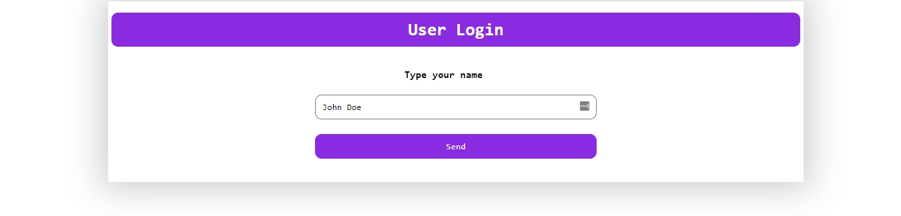
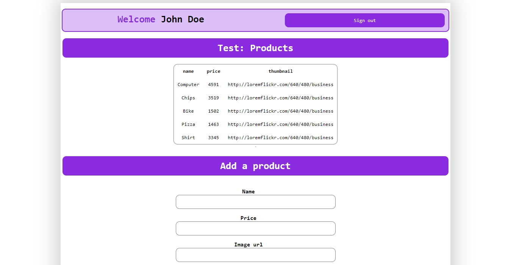
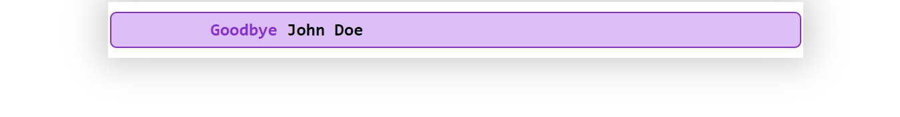

# Desafío 6 (Modificado al desafío 12)

* En esta entrega (n°12) he utilizado **connect-mongo** y **express-session** para crear cookies de sesión y almacenarlas en **Mongo Atlas**.

## Websockets

* Socket.IO
* Express.js
* Handlebars.js
* MySQL
* SQLite3
* Faker.js
* Connect-mongo
* Express-session

## Preview

* Login

* Main

* Logout

