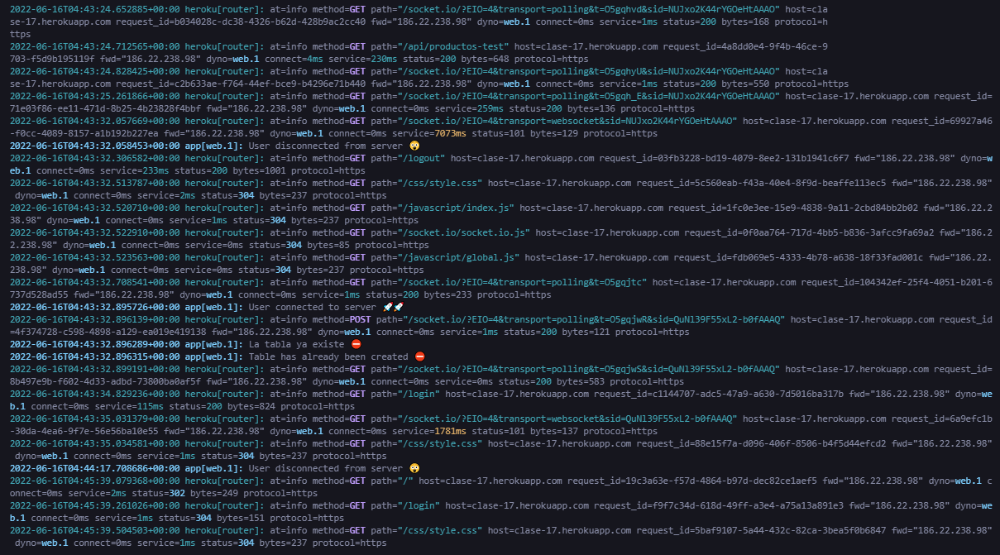
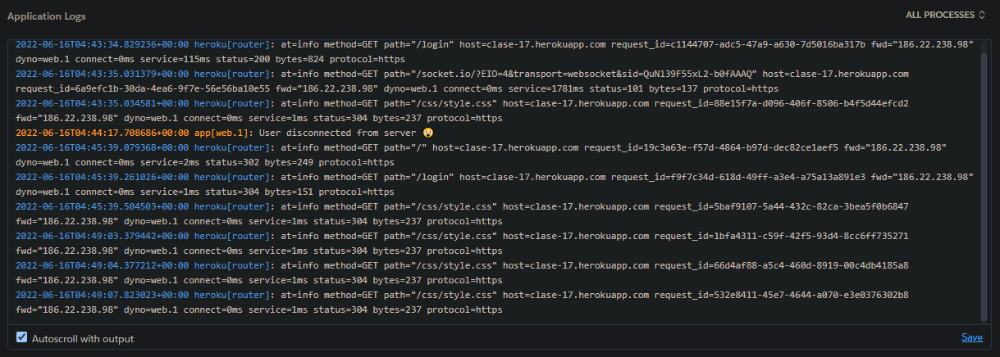

# Desafío 6 (Modificado al desafío 17)

* En esta entrega he realizado un **branch** llamado heroku con el motivo de modificar el código y desplegarlo en Heroku.
<a href="https://clase-17.herokuapp.com" target="_blank"><b>View Heroku Deploy</b></a>

## Tecnologías usadas:

* Socket.IO
* Express.js
* Handlebars.js
* SQLite3
* Faker.js
* Connect-mongo
* Express-session

## Heroku logs preview

* Console

* Heroku

